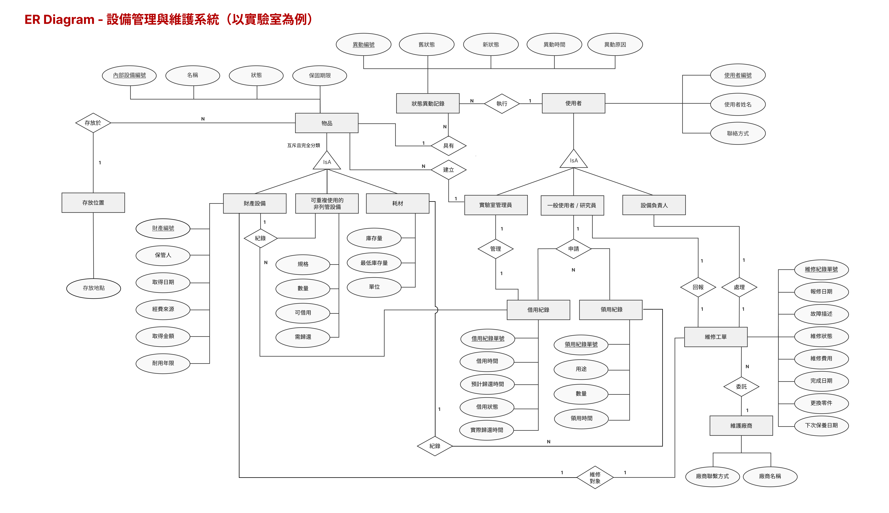

# 設備管理與維護系統(以實驗室為例)
- Final Project Part I 
- https://github.com/TerryOrin/114-2-DB_System-Project

## 目錄
[一、應用情境](#一、應用情境)
[二、使用案例](#二、使用案例)
[三、系統需求說明（Functional Requirements）](#三、系統需求說明（Functional-Requirements）)
[四、完整性限制（Integrity Constraints）](#四、完整性限制（Integrity-Constraints）)
[五、ER Diagram（Entity-Relationship Diagram）](#五、ER-Diagram（Entity-Relationship-Diagram）)

## 一、應用情境
- 背景：學校實驗室的設備與物品種類繁多，依管理方式可分為三類：一是貼有財產標籤列管的「財產設備」（如：伺服器、示波器）；二是未貼財產標籤管理的「可重複使用的非列管設備」（如：滑鼠、轉接頭、開發板擴充模組）；三是單價較低、會被消耗的「日常耗材」（如：杜邦線、電子零件）。
- 痛點： 
     1. 資產流向不明與責任歸屬困難：高價設備與共用硬體僅靠紙本或人工記憶管理，常因保管人畢業或實驗室搬遷導致流向不明。更嚴重的是，當設備發生損壞或遺失時，由於缺乏完整的「使用歷程追蹤」，往往無法追溯「上一個借用者是誰」，導致責任歸屬不清，維修成本只能由實驗室自行吸收。
    2. 耗材領用成管理瓶頸：目前耗材的領用極度依賴人工登記。學生每次領用，都必須中斷實驗室管理員（TA或研究生）的工作，由管理員手動登入系統扣除庫存。這不僅嚴重消耗管理員的時間，實務上更常發生學生「先拿了再說、事後忘記補登記」的狀況，導致系統帳面庫存與實際數量嚴重脫節。
- 解決方案：本專題擬開發一套「設備管理與維護系統(以實驗室為例)」。針對具名資產與共用設備，系統將建立完整的 **「使用歷程追蹤（Audit Trail）」機制，精準記錄每一次的借還時間與經手人員；當設備報修時，管理者可一鍵查詢該設備的歷史流向與上一個借用者，釐清責任歸屬**。針對耗材，系統將導入「領用與審計機制」，將登記責任分散給使用者，並結合低水位預警功能。這將大幅降低管理員的行政負擔，同時確保實驗室資源的透明、數據的即時性與設備的妥善管理。

## 二、使用案例
### 關鍵使用案例：實驗室資產與耗材管理系統
#### 角色一：實驗室管理員 (Lab Manager)
- UC1：建立資產基本資訊 (Create Basic Asset Information)
    - 目標：建立設備或耗材的初始數位身分。
    - 描述：管理員取得新物品後，先建立獨立的實驗室內部設備編號，並記錄名稱、類型、狀態與存放位置。若該物品屬於財產設備，則需額外登錄財產編號、經費來源、保管人、取得日期、取得金額與耐用年限。
> 關鍵規則： 實驗室內部識別資訊不可重複；若物品類型為財產設備，則財產編號不得為空且不可重複。
- UC2：耗材庫存管理（Consumable Stock Management）
    - 目標：追蹤耗材庫存與補貨需求。
    - 描述：管理員建立耗材資料，記錄目前庫存量、最低庫存量與單位。當使用者領用耗材後，系統扣除庫存量；若低於最低庫存量，系統提醒補貨。
> 關鍵規則：耗材庫存不可小於 0，領用數量不可大於目前庫存量。
- UC3：設備停用與報廢狀態更新 (Equipment Deactivation and Disposal Status Update)
    - 目標：記錄設備生命週期後期的狀態變更。
    - 描述：當設備超過耐用年限、維修成本過高或不堪使用時，實驗室管理員可將設備狀態更新為「停用」或「報廢」，並於狀態異動紀錄中記錄異動時間、操作者與異動原因。
> 關鍵規則：當物品狀態被更新為「報廢」時，系統必須產生一筆狀態異動紀錄；已報廢物品不得再被借用或建立新的維修工單。

#### 角色二：一般使用者 / 研究員 (Researcher)
- UC4：設備借用與歸還 (Equipment Borrowing and Return)
    - 目標：追蹤可重複使用設備的實體位置、使用情況與責任人。
    - 描述：使用者查詢可借用設備後發起借用申請，系統記錄借用時間、預計歸還時間、實際歸還時間與借用狀態。
> 關鍵規則：耗材不得建立借用紀錄；耗材僅能透過領用紀錄進行管理。
- UC5：故障異常報修 (Issue Reporting)
    - 目標：快速反應設備失效狀態。
    - 描述：使用者發現開發板或儀器異常，建立維修工單並詳述故障現象。

#### 角色三：設備負責人（Equipment Supervisor）
- UC6：維修結案與回報 (Maintenance Fulfillment)
    - 目標： 紀錄維修成本與結果。
    - 描述： 設備完成維護後，回填維修金額、更換零件紀錄與建議下次保養日期 。
- UC7：預防性維護排程 (Maintenance Scheduling)
    - 目標： 確保精密儀器在有效校準(保固)期內。
    - 描述： 系統依據耐用年限與上次保養日，自動通知設備負責人進行校準 。

## 三、系統需求說明（System Requirements）
本系統之需求規劃旨在解決實驗室設備流向不明、維修責任難以追蹤、耗材庫存管理不即時，以及人工管理負擔過重等問題。系統將實驗室物品分為「財產設備」、「可重複使用的非列管設備」與「耗材」三種類型，並以實驗室內部識別資訊作為辨識、查詢與追蹤各類物品的主要依據。

### 1. 功能性需求（Functional Requirements）

#### A. 物品分類與內部識別資訊管理（Item Classification and Internal Identification Management）
- **物品分類管理：**
  系統須支援三種物品類型，包含財產設備、可重複使用的非列管設備與耗材。不同類型的物品需記錄不同資料，以符合實驗室實際管理需求。
- **實驗室內部設備資訊建立：**
  每一項進入實驗室管理範圍的設備或耗材，都必須建立獨立的實驗室內部設備編號。該編號作為系統查詢、盤點、借用、領用、維修與庫存管理的主要依據。
- **基本資料管理：**
  系統須描述物品的基本資訊，例如物品名稱、管理類型、類別、存放位置、設備負責人、目前狀態、保固期限與備註。
- **規格與多實體管理:**
  系統可於物品資料或子類型資料中記錄規格說明。對於相同規格但不同實體的設備，系統仍以各自的實驗室內部識別資訊進行追蹤。

---

#### B. 財產設備管理（Asset Equipment Management）
- **財產標籤資料登錄：**
  針對有財產標籤的財產設備，系統須額外記錄財產編號、財產標籤上的保管人、取得日期、經費來源、取得金額與耐用年限、保固期限。
- **保管人與設備負責人區分：**
  系統須區分「保管人」與「設備負責人」。保管人為財產標籤上登記的正式保管人；設備負責人則為實驗室內部指派，負責追蹤設備狀態、位置、盤點與維修通報。
- **報廢評估：**
  系統依據取得金額、取得日期與耐用年限評估設備狀態資訊。當設備超過耐用年限、維修成本過高或狀態不堪使用時，系統可提供報廢或汰換建議，作為管理員決策參考。

---

#### C. 可重複使用的非列管設備管理（Management of Reusable Non-Controlled Equipment）
- **無財產標籤設備管理：**
  針對沒有財產標籤但可重複使用的非列管設備，例如鍵盤、滑鼠、轉接頭、延長線、開發板與感測器模組等，系統須以實驗室內部編號進行管理。
- **數量與規格管理：**
  系統須能記錄可重複使用的非列管設備的規格、數量、存放位置、是否可借用與是否需歸還。
- **借用狀態管理：**
  若可重複使用的非列管設備可供借用，系統須保留設備借用過程中的使用者、借用時間、預計歸還時間、實際歸還情形與借用狀態，以利追蹤設備流向。

---

#### D. 耗材庫存與自助領用（Consumables & Inventory Management）
- **耗材資料管理：**
  系統須支援耗材品項管理，例如電池、螺絲、束線帶、電子零件、線材與清潔用品等，並記錄目前庫存量、最低庫存量、單位、存放位置與備註。
- **耗材領用登記：**
  系統須提供使用者端的耗材領用登記功能。使用者領用耗材時，系統需記錄領用人、領用日期、領用數量與用途，並即時扣除庫存量。
- **低庫存預警：**
  當耗材庫存量低於預設最低庫存量時，系統須提醒實驗室管理員或設備負責人進行補貨。

---

#### E. 使用歷程與審計追蹤（Audit Trail & Accountability）
- **借還紀錄追蹤：**
  系統須完整記錄每一次設備借用與歸還，包括借用人、借用時間、預計歸還時間、實際歸還時間與設備狀態。
- **責任溯源查詢：**
  當設備發生故障、遺失或損壞時，管理員須能查詢該設備的使用歷程、前一位借用者與相關維修紀錄，以協助釐清責任歸屬。
- **狀態異動紀錄：**
  系統須記錄物品狀態變更歷程，例如可使用、借出中、維修中、停用、報廢或遺失。每筆狀態異動須包含操作者、異動時間與異動原因。

---

#### F. 維修工單與維護管理（Maintenance Management）
- **故障回報：**
  使用者發現設備異常時，須能依實驗室內部編號或財產編號查詢設備，並建立故障回報，說明異常情形。
- **維修工單管理：**
  設備負責人或實驗室管理員確認故障後，系統須能建立維修工單，記錄報修日期、故障描述、維修狀態、外部廠商、維修費用、更換零件與維修結果。
- **維修結案與成本統計：**
  設備維修完成後，系統須記錄完成日期、實際維修金額與處理結果，並將維修費用累計至該設備的總維護成本，作為後續汰換或報廢評估依據。

---

### 2. 非功能性需求（Non-Functional Requirements）
#### A. 資料一致性與完整性（Data Integrity）
- 系統須確保實驗室內部編號不可重複。
- 若物品類型為財產設備，財產編號不可為空且不可重複。
- 耗材庫存量不可小於 0。
- 耗材領用數量不可大於目前庫存量。
- 維修結案日期不得早於報修日期。
- 設備歸還日期不得早於借用日期。

#### B. 權限控管（Role-Based Access Control）
- 系統須依照使用者角色設定不同操作權限。
- 一般使用者可查詢設備、借用設備、領用耗材與回報故障。
- 設備負責人可確認設備狀態、處理故障回報、更新維修進度與管理負責項目。
- 實驗室管理員可新增、修改、停用物品資料，並進行盤點、停用與報廢狀態管理、庫存管理與權限管理。
- 一般使用者不得修改物品狀態異動紀錄、刪除維修紀錄或更改他人借用紀錄。

#### C. 可追溯性（Traceability）
- 系統須保留設備借用紀錄、耗材領用紀錄、維修紀錄、狀態異動紀錄與狀態異動紀錄。
- 當物品已有相關歷史紀錄時，不應直接刪除該物品資料，應改以停用或封存方式處理，以維持資料可追溯性。

#### D. 庫存資料一致性（Inventory Consistency）
- 當多人同時領用同一耗材時，系統須確保庫存扣減結果正確。
- 系統不得允許庫存量被扣成負數。
- 系統須即時更新耗材庫存量，避免帳面數量與實際數量差距過大。

## 四、 完整性限制 (Integrity Constraints)
為了確保實驗室設備資料的正確性，本系統從概念模型層次定義以下約束規則，以確保資料在任何操作下皆具備嚴謹的一致性：

### 1. 實體完整性 (Entity Integrity)
- **獨立識別限制：** 每一項物品（無論是資產、可重複使用的非列管設備或耗材）必須具備獨立的「實驗室內部設備編號」，且該識別資訊不得缺失。
- **歷程紀錄獨立性：** 系統中產生的每一筆借用、領用、維護及狀態異動紀錄，均須具備全系統獨立的識別資訊，以供精確回溯。

### 2. 參照完整性 (Referential Integrity)
- **歸屬一致性：** 物品所關聯的「類別資訊」、「存放地點」及「設備負責人」，必須對應至系統中已定義之有效實體基礎資料。
- **操作對象有效性：**
    - 借用紀錄中所指向之物品，必須為系統內已登錄之有效實體。
    - 維修工單必須與特定之設備實體及維護廠商資訊具備強連結關聯。

### 3. 值域完整性 (Domain Integrity)
- **枚舉值約束：**
    - 物品之「管理類型」僅限於「財產設備」、「可重複使用的非列管設備」或「日常耗材」。
    - 物品之「運作狀態」僅限於「可用」、「借出中」、「維修中」、「停用」、「報廢」或「遺失」。
- **數值邏輯約束：**
    - 耗材之「庫存量屬性」必須恆大於或等於零。
    - 取得金額、維修費用等財務數據必須符合非負值規範。
- **格式檢核：** 系統所有涉及日期之資料項目（如：取得日期、報修日期）須符合標準時間戳記格式。

### 4. 使用者自訂完整性（User-defined Integrity）
- **財產資料限制：**
  若物品類型為「財產設備」，則必須記錄財產編號，且財產編號不可重複；若物品類型為「一般設備」或「耗材」，則財產編號無須配置。財產設備必須記錄財產標籤上的保管人，且只有財產設備需要建立折舊紀錄。
- **負責人限制：**
  每一項設備或耗材都必須指定一位設備負責人，以利後續盤點、維護與責任追蹤。
- **借用限制：**
  若物品類型為「耗材」，則不得建立借用紀錄。若物品狀態為「維修中」、「停用」、「報廢」或「遺失」，則不得建立新的借用紀錄。同一物品在同一時間只能存在一筆尚未歸還的借用紀錄。
- **耗材領用限制：**
  若物品類型為「耗材」，則不得建立維修工單。耗材領用數量必須大於 0，且不得大於目前庫存量。當耗材領用紀錄建立後，系統須同步扣減對應耗材庫存量。
- **日期與狀態異動限制：**
  維修完成日期不得早於報修日期，設備歸還日期不得早於借用日期。當物品狀態變更時，系統須建立一筆狀態異動紀錄。
- **歷史紀錄保存限制：**
  已有借用、領用、維修或狀態異動紀錄的物品，不應直接刪除，應改為停用或封存，以保留完整使用歷程。

## 五、ER Diagram（Entity-Relationship Diagram）

