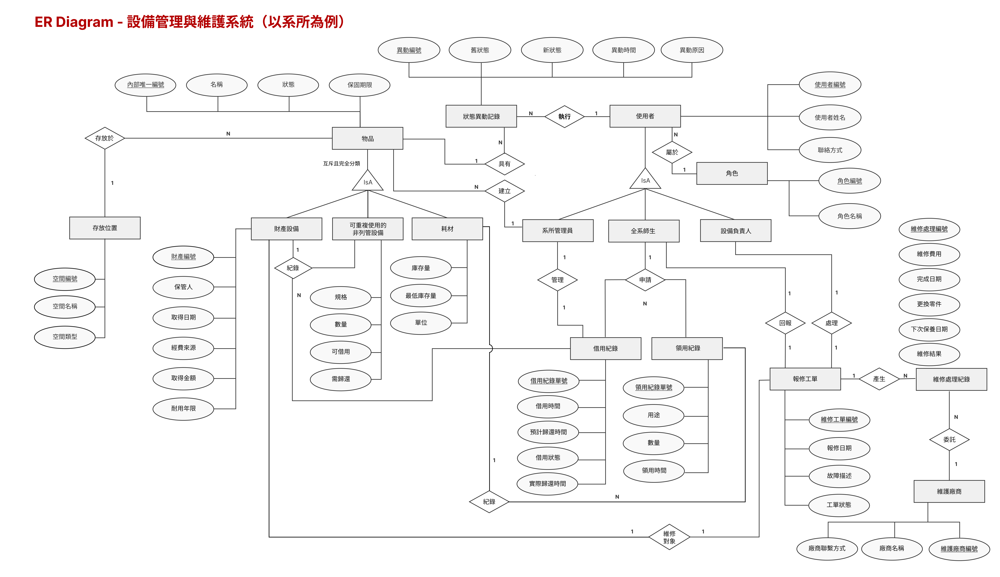

# 設備管理與維護系統 Final Project Part III
> **Final Project Part III** > 🔗 [GitHub Repository: 114-2-DB_System-Project](https://github.com/TerryOrin/114-2-DB_System-Project)

## 目錄
- [一、應用情境](#一、應用情境)
- [二、使用案例](#二、使用案例)
- [三、系統需求說明（Functional Requirements）](#三、系統需求說明（Functional-Requirements）)
- [四、完整性限制（Integrity Constraints）](#四、-完整性限制-Integrity-Constraints)
- [五、ER Diagram（Entity-Relationship Diagram）](#五、ER-Diagram（Entity-Relationship-Diagram）)
- [六、資料庫 Schema 設計與 SQL 語法說明](六、資料庫-Schema-設計與-SQL-語法說明)

## 一、應用情境

- **背景**：大學系所轄下的空間（含系辦公室、教學實驗室、教授專屬實驗室與一般教室）設備與物品種類繁多，依管理方式可分為三類：
  1. `財產設備`：貼有學校或系所財產標籤列管（如：伺服器、高階儀器、投影機）。
  2. `可重複使用的非列管設備`：未貼財產標籤管理（如：簡報筆、轉接頭、開發板、系辦推車）。
  3. `日常耗材`：單價較低、會被頻繁消耗（如：白板筆、影印紙、教學用電子零件）。

- **痛點**： 
  1. **資產流向不明與跨空間調度困難**：高價設備與共用硬體若僅靠紙本或各實驗室自行記憶管理，常因教職員離職、學生畢業或設備在不同教室間借用而導致流向不明。當設備損壞時，缺乏跨空間的「使用歷程追蹤」，無法追溯上一個借用者或釐清是教學損耗還是人為破壞，維修成本往往只能由系辦公室吸收。
  2. **耗材領用成行政瓶頸**：系上耗材（尤其是教學實驗耗材或辦公文具）的領用極度依賴系助教或行政人員人工登記。全系師生頻繁的領用需求嚴重消耗行政時間，且常發生「先拿了再說、事後忘記補登記」的狀況，導致系辦系統帳面庫存與實際數量嚴重脫節，影響後續採購編列。

- **解決方案**：本專題擬開發一套 **「設備管理與維護系統(以系所為例)」**。
  - **針對具名資產與共用設備**：系統將建立完整的「使用歷程追蹤（Audit Trail）」機制，精準記錄每一次在全系不同空間的借還時間與經手人員；當報修時，系管人員可一鍵查詢該設備的歷史流向，釐清責任歸屬。
  - **針對耗材**：系統導入「自助領用與審計機制」，將登記責任分散給全系使用者，並結合低水位預警功能，大幅降低系辦的行政負擔，確保系所資源透明與妥善分配。

## 二、使用案例

###  角色一：系所管理員 (Department Administrator / 系助教)

**UC1：建立資產基本資訊 (Create Basic Asset Information)**
- **目標**：建立全系設備或耗材的初始數位身分。
- **描述**：系辦取得新物品後，建立獨立的 `內部設備編號`，記錄名稱、類型、狀態與歸屬空間（如：系辦公室或特定實驗室）。若為 `財產設備`，需額外登錄學校財產編號、經費來源、保管人（通常為教授或系主任）、取得日期、金額與耐用年限。
>  **關鍵規則**： `內部設備編號` 不可重複；若物品類型為 `財產設備`，`財產編號` 不得為空且不可重複。

**UC2：耗材庫存管理（Consumable Stock Management）**
- **目標**：追蹤全系公用或教學耗材庫存與採購需求。
- **描述**：管理員建立耗材資料，記錄目前庫存量、最低庫存量與單位。師生領用後扣除庫存；低於最低庫存量時，系統提醒系辦進行採購。
>  **關鍵規則**：耗材庫存不可 `< 0`，領用數量不可 `>` 目前庫存量。

**UC3：設備停用與報廢狀態更新 (Equipment Deactivation and Disposal Status Update)**
- **目標**：記錄系所設備生命週期後期的狀態變更。
- **描述**：當設備超過耐用年限或不堪使用時，系所管理員可將狀態更新為 `停用` 或啟動 `報廢` 流程，並記錄異動時間、操作者與原因，以利後續向學校總務處核銷。
>  **關鍵規則**：更新為 `報廢` 時須產生狀態異動紀錄；已報廢物品不得再借用或建立維修工單。

###  角色二：全系師生 (Faculty and Students)

**UC4：設備借用與歸還 (Equipment Borrowing and Return)**
- **目標**：追蹤共用設備的實體位置與責任人。
- **描述**：師生查詢系上可借用設備後發起借用申請，系統記錄借用時間、預計歸還時間、實際歸還時間與借用狀態。
>  **關鍵規則**：`耗材` 不得建立借用紀錄，僅能透過領用紀錄管理。

**UC5：故障異常報修 (Issue Reporting)**
- **目標**：快速反應教學或研究設備的失效狀態。
- **描述**：師生於教室或實驗室發現設備異常，建立維修工單通報系辦或設備負責人。

###  角色三：空間/設備負責人 (Space/Equipment Supervisor)
*(各實驗室專責助教或工讀生)*

**UC6：維修結案與回報 (Maintenance Fulfillment)**
- **目標**：紀錄各空間設備的維修成本與結果。
- **描述**：設備完成維護後，負責人回填維修金額、廠商資訊與更換紀錄。

**UC7：預防性維護排程 (Maintenance Scheduling)**
- **目標**：確保系上精密儀器或重要設施正常運作。
- **描述**：系統依據保養週期自動通知該空間/設備負責人進行檢修。

## 三、系統需求說明（Functional Requirements）

### 1. 功能性需求（Functional Requirements）

#### A. 物品分類與內部識別資訊管理
* **物品分類管理**：支援 `財產設備`、`可重複使用的非列管設備` 與 `耗材` 三類。
* **系所內部設備資訊建立**：每項受管設備須有獨立的 `內部設備編號`，作為跨空間查詢與追蹤依據。
* **基本資料管理**：記錄名稱、類別、存放空間（特定教室/實驗室/系辦）、空間負責人、狀態與保固。
* **規格與多實體管理**：同規格但不同實體的設備（如 50 張同款辦公椅），以各自的識別資訊獨立追蹤。

#### B. 財產設備管理
* **財產標籤資料登錄**：記錄學校財產編號、保管人（教職員）、經費來源、取得金額與耐用年限。
* **保管人與設備負責人區分**：`保管人` 為財產層級負責人（教授）；`設備負責人` 為實際管理日常運作的人員（助教或研究生）。
* **報廢評估**：提供報廢建議供系辦參考，以銜接校方總務系統的報廢流程。

#### C. 可重複使用的非列管設備管理
* **無財產標籤設備管理**：針對簡報筆、轉接線等，以系所內部編號管理。
* **借用狀態管理**：保留跨系所空間借用的使用者、時間與歸還情形。

#### D. 耗材庫存與自助領用
* **耗材資料管理**：支援影印紙、實驗材料等管理，記錄存放位置（如系辦物資櫃）。
* **自助領用登記**：師生領用時記錄身分、數量與用途，即時扣除庫存。
* **低庫存預警**：自動提醒系辦行政人員補貨。

#### E. 使用歷程與審計追蹤
* **借還與責任溯源**：完整記錄全系設備借還，發生遺失損壞時可追溯上一位經手的師生。
* **狀態異動紀錄**：記錄 `可用`、`借出`、`維修`、`停用`、`報廢` 等變更歷程。

#### F. 維修工單與維護管理
* **跨空間故障回報**：師生依編號建立故障回報。
* **維修與成本統計**：記錄廠商、費用，累計設備維護成本供系所經費編列參考。

### 2. 非功能性需求（Non-Functional Requirements）

#### A. 資料一致性與完整性
* `系所內部編號` 不可重複；`財產編號` 不可為空且不可重複。
* 庫存不可 `< 0`；領用量不可 `>` 庫存。
* 維修結案與歸還日期的時序邏輯必須正確。

#### B. 權限控管（Role-Based Access Control）
* **全系師生**：可查詢、借用、領用、報修。
* **空間/設備負責人**：管理轄下空間設備狀態、處理報修工單。
* **系所管理員**：擁有全系最高權限，可進行跨空間盤點、報廢審查、庫存採購與帳號權限管理。

#### C. 可追溯性 與 D. 庫存資料一致性
* 確保高併發下（如開學初大量領用耗材）的庫存扣減正確性。
* 歷史紀錄採**封存 (Archived)** 而非物理刪除。

## 四、 完整性限制 (Integrity Constraints)

### 1. 實體完整性 (Entity Integrity)
> 每一項物品必須具備獨立的 `內部設備編號` (Primary Key)，且不得缺失 (Not Null)。歷程紀錄亦須具備獨立識別資訊。
> 

### 2. 參照完整性 (Referential Integrity)
> 歸屬之 `類別`、`存放地點`（如特定教室編號）及 `負責人` (Foreign Keys) 必須對應系統中有效實體。借用與維修關聯之設備必須為有效實體。

### 3. 值域完整性 (Domain Integrity)
> - **狀態 (Status)**：限於 `可用`、`借出中`、`維修中`、`停用`、`報廢` 或 `遺失`。
> - **數值 (Numeric)**：財務與庫存數據須為非負值 (`>= 0`)。
> - **日期 (Date)**：須符合標準 Timestamp 格式。

### 4. 使用者自訂完整性（User-defined Integrity）（許願池）
* **財產資料與負責人限制**：財產設備必填 `財產編號` 與 `保管人`。每項設備需指定 `設備負責人`。
* **借用與領用限制**：耗材不可借用，僅能領用。異常狀態設備不可借用。單一設備同一時間僅限一筆未歸還紀錄。
* **時序與歷程限制**：嚴格控管維修與借還的時間先後順序；有歷史紀錄的物品禁止物理刪除。

## 五、ER Diagram（Entity-Relationship Diagram）/ Database schema
### ER Diagram

## 六、資料庫 Schema 設計與 SQL 語法說明

本節依據 ER Diagram 中已出現之實體、關聯與屬性進行整理，作為後續轉換成資料庫 Schema 與 SQL `CREATE TABLE` 語法的依據。為了區分不同類型的資料庫設計元素，本節使用以下標示：

* **■【實體】**：代表 ER Diagram 中的實體，通常會轉換成資料表。
* **◆【關聯】**：代表 ER Diagram 中的關聯，通常會轉換成外鍵或關聯資料表。
* **△【ISA】**：代表繼承 / 分類關係，表示父實體與子實體之間的分類設計。

---

### 1. ■【實體】屬性與限制對應表

#### A. 物品與存放位置

| 標示     | 實體     | 目標屬性     | 限制類型   | 完整性限制 / Business Rules                               |
| -------- | -------- | ------------ | ---------- | --------------------------------------------------------- |
| 【實體】 | 物品     | 內部設備編號 | 實體完整性 | 不可為空，且不可重複，作為物品主要識別依據                |
| 【實體】 | 物品     | 名稱         | 值域完整性 | 不可為空                                                  |
| 【實體】 | 物品     | 狀態         | 值域完整性 | 僅能為 `可用`、`借出中`、`維修中`、`停用`、`報廢`、`遺失` |
| 【實體】 | 物品     | 保固期限     | 值域完整性 | 必須為合法日期格式                                        |
| 【實體】 | 存放位置 | 存放地點     | 實體完整性 | 不可為空，且應能唯一識別存放位置                          |

#### B. 物品分類子實體

| 標示    | 實體          | 目標屬性  | 限制類型     | 完整性限制 / Business Rules |
| ----- | ----------- | ----- | -------- | ---------------------- |
| 【實體】 | 財產設備        | 財產編號  | 實體完整性    | 不可為空，且不可重複             |
| 【實體】 | 財產設備        | 保管人   | 使用者自訂完整性 | 財產設備必須記錄保管人            |
| 【實體】 | 財產設備        | 取得日期  | 值域完整性    | 必須為合法日期格式              |
| 【實體】 | 財產設備        | 經費來源  | 值域完整性    | 應記錄有效經費來源              |
| 【實體】 | 財產設備        | 取得金額  | 數值限制     | 必須大於等於 0               |
| 【實體】 | 財產設備        | 耐用年限  | 數值限制     | 必須為正整數或大於 0            |
| 【實體】 | 可重複使用的非列管設備 | 規格    | 值域完整性    | 不可為空，需描述設備規格           |
| 【實體】 | 可重複使用的非列管設備 | 數量    | 數值限制     | 必須為整數，且大於等於 0          |
| 【實體】 | 可重複使用的非列管設備 | 可借用   | 值域完整性    | 僅能為 `是` / `否`          |
| 【實體】 | 可重複使用的非列管設備 | 需歸還   | 值域完整性    | 僅能為 `是` / `否`          |
| 【實體】 | 耗材          | 庫存量   | 數值限制     | 必須為整數，且大於等於 0          |
| 【實體】 | 耗材          | 最低庫存量 | 數值限制     | 必須為整數，且大於等於 0          |
| 【實體】 | 耗材          | 單位    | 值域完整性    | 不可為空，例如：包、盒、支、張        |

#### C. 使用者與角色

| 標示    | 實體    | 目標屬性  | 限制類型   | 完整性限制 / Business Rules |
| ----- | ----- | ----- | ------ | ---------------------- |
| 【實體】 | 使用者   | 使用者編號 | 實體完整性  | 不可為空，且不可重複             |
| 【實體】 | 使用者   | 使用者姓名 | 值域完整性  | 不可為空                   |
| 【實體】 | 使用者   | 聯絡方式  | 值域完整性  | 應記錄有效聯絡方式              |
| 【實體】 | 系所管理員 | 無額外屬性 | ISA 限制 | 繼承使用者之使用者編號、使用者姓名、聯絡方式 |
| 【實體】 | 全系師生  | 無額外屬性 | ISA 限制 | 繼承使用者之使用者編號、使用者姓名、聯絡方式 |
| 【實體】 | 設備負責人 | 無額外屬性 | ISA 限制 | 繼承使用者之使用者編號、使用者姓名、聯絡方式 |

#### D. 狀態異動紀錄

| 標示    | 實體     | 目標屬性 | 限制類型     | 完整性限制 / Business Rules |
| ----- | ------ | ---- | -------- | ---------------------- |
| 【實體】 | 狀態異動紀錄 | 異動編號 | 實體完整性    | 不可為空，且不可重複             |
| 【實體】 | 狀態異動紀錄 | 舊狀態  | 值域完整性    | 必須為物品狀態的合法值            |
| 【實體】 | 狀態異動紀錄 | 新狀態  | 值域完整性    | 必須為物品狀態的合法值            |
| 【實體】 | 狀態異動紀錄 | 異動時間 | 值域完整性    | 不可為空，必須為合法時間格式         |
| 【實體】 | 狀態異動紀錄 | 異動原因 | 使用者自訂完整性 | 狀態變更時應記錄異動原因           |

#### E. 借用紀錄與領用紀錄

| 標示    | 實體   | 目標屬性   | 限制類型     | 完整性限制 / Business Rules        |
| ----- | ---- | ------ | -------- | ----------------------------- |
| 【實體】 | 借用紀錄 | 借用紀錄單號 | 實體完整性    | 不可為空，且不可重複                    |
| 【實體】 | 借用紀錄 | 借用時間   | 時序限制     | 不可為空，且必須早於實際歸還時間              |
| 【實體】 | 借用紀錄 | 預計歸還時間 | 時序限制     | 應晚於借用時間                       |
| 【實體】 | 借用紀錄 | 實際歸還時間 | 時序限制     | 若已歸還，不得早於借用時間                 |
| 【實體】 | 借用紀錄 | 借用狀態   | 值域完整性    | 僅能為 `借用中`、`已歸還`、`逾期`、`取消` 等狀態 |
| 【實體】 | 領用紀錄 | 領用紀錄單號 | 實體完整性    | 不可為空，且不可重複                    |
| 【實體】 | 領用紀錄 | 用途     | 使用者自訂完整性 | 領用時應記錄用途                      |
| 【實體】 | 領用紀錄 | 數量     | 數值限制     | 必須為正整數，且不可大於對應耗材庫存量           |
| 【實體】 | 領用紀錄 | 領用時間   | 值域完整性    | 不可為空，必須為合法時間格式                |

#### F. 維修工單與維護廠商

| 標示    | 實體   | 目標屬性   | 限制類型     | 完整性限制 / Business Rules         |
| ----- | ---- | ------ | -------- | ------------------------------ |
| 【實體】 | 維修工單 | 維修工單編號 | 實體完整性    | 不可為空，且不可重複                     |
| 【實體】 | 維修工單 | 報修日期   | 值域完整性    | 不可為空，必須為合法日期格式                 |
| 【實體】 | 維修工單 | 故障描述   | 使用者自訂完整性 | 報修時應填寫故障內容                     |
| 【實體】 | 維修工單 | 維修狀態   | 值域完整性    | 僅能為 `待處理`、`處理中`、`已完成`、`取消` 等狀態 |
| 【實體】 | 維修工單 | 維修費用   | 數值限制     | 必須大於等於 0                       |
| 【實體】 | 維修工單 | 完成日期   | 時序限制     | 不得早於報修日期                       |
| 【實體】 | 維修工單 | 更換零件   | 使用者自訂完整性 | 若有更換零件，應記錄零件內容                 |
| 【實體】 | 維修工單 | 下次保養日期 | 時序限制     | 應晚於完成日期或報修日期                   |
| 【實體】 | 維護廠商 | 廠商名稱   | 實體完整性    | 不可為空；若以廠商名稱作為識別，則應避免重複         |
| 【實體】 | 維護廠商 | 廠商聯繫方式 | 值域完整性    | 應記錄有效聯絡方式                      |

---

### 2. ◆【關聯】與 △【ISA】限制對應表

| 標示            | 關聯 / ISA | 連接對象                         | 圖中基數      | 完整性限制 / Business Rules             |
| ------------- | -------- | ---------------------------- | --------- | ---------------------------------- |
| 【關聯】`<存放於>`  | 存放於      | 物品 — 存放位置                    | N : 1     | 每項物品必須存放於一個有效的存放位置；一個存放位置可存放多項物品   |
| 【ISA】        | 物品分類     | 物品 — 財產設備 / 可重複使用的非列管設備 / 耗材 | 互斥且完全分類   | 每項物品必須且只能屬於三種類型之  一                  |
| 【關聯】`<具有>`   | 具有       | 物品 — 狀態異動紀錄                  | 1 : N     | 一項物品可有多筆狀態異動紀錄；每筆異動紀錄必須對應一項物品      |
| 【關聯】`<執行>`   | 執行       | 使用者 — 狀態異動紀錄                 | 1 : N     | 每筆狀態異動紀錄必須由一位使用者執行；一位使用者可執行多筆異動    |
| 【關聯】`<建立>`   | 建立       | 系所管理員 — 物品                   | 1 : N     | 物品資料由系所管理員建立；一位系所管理員可建立多筆物品資料      |
| 【ISA】        | 使用者分類    | 使用者 — 系所管理員 / 全系師生 / 設備負責人   | 圖中未標明是否互斥 | 三種角色皆繼承使用者資料；角色必須對應到有效使用者          |
| 【關聯】`<管理>`   | 管理       | 系所管理員 — 借用紀錄                 | 1 : 1     | 借用紀錄須由系所管理員管理                      |
| 【關聯】`<申請>`   | 申請       | 全系師生 — 借用紀錄                  | 1 : N     | 全系師生可申請多筆借用紀錄；每筆借用紀錄須對應一位申請者       |
| 【關聯】`<申請>`   | 申請       | 全系師生 — 領用紀錄                  | 1 : N     | 全系師生可申請多筆領用紀錄；每筆領用紀錄須對應一位申請者       |
| 【關聯】`<回報>`   | 回報       | 全系師生 — 維修工單                  | 1 : 1     | 維修工單由全系師生回報                        |
| 【關聯】`<處理>`   | 處理       | 設備負責人 — 維修工單                 | 1 : 1     | 維修工單由設備負責人處理                       |
| 【關聯】`<委託>`   | 委託       | 維修工單 — 維護廠商                  | N : 1     | 多張維修工單可委託同一廠商；每張委外工單須對應一個有效廠商      |
| 【關聯】`<紀錄>`   | 紀錄       | 財產設備 / 可重複使用的非列管設備 — 借用紀錄    | 1 : N     | 可被借用的設備可產生多筆借用紀錄；每筆借用紀錄須對應一項設備     |
| 【關聯】`<紀錄>`   | 紀錄       | 耗材 — 領用紀錄                    | 1 : N     | 一項耗材可有多筆領用紀錄；每筆領用紀錄須對應一項耗材         |
| 【關聯】`<維修對象>` | 維修對象     | 物品 / 設備 — 維修工單               | 1 : 1     | 每張維修工單須對應一個維修對象；維修對象必須是系統中存在的物品或設備 |

---

### 3. ER Diagram 轉換成資料庫 Schema 的設計說明

| ER Diagram 項目 | Schema 轉換方式           | 說明                                            |
| ------------- | --------------------- | --------------------------------------------- |
| 【實體】         | 轉換為資料表                | 例如：`物品`、`使用者`、`借用紀錄`、`維修工單` 等皆可轉換為資料表         |
| 【實體】的識別屬性    | 轉換為 Primary Key       | 例如：`內部設備編號`、`使用者編號`、`借用紀錄單號`、`維修工單編號`         |
| 【關聯】1 : N    | 通常在 N 方加入 Foreign Key | 例如：一個存放位置可存放多項物品，因此可在 `物品` 資料表中加入 `存放地點` 作為外鍵 |
| 【關聯】1 : 1    | 可在任一方加入 Foreign Key   | 例如：`維修工單` 與 `設備負責人` 的處理關係，可在 `維修工單` 中記錄處理者    |
| 【關聯】N : 1    | 通常在 N 方加入 Foreign Key | 例如：多張維修工單可委託同一廠商，因此可在 `維修工單` 中加入廠商識別資料        |
| 【ISA】        | 可採用父表 + 子表設計          | 例如：`物品` 為父表，`財產設備`、`可重複使用的非列管設備`、`耗材` 為子表     |
| 【ISA】子實體     | 子表主鍵同時作為外鍵            | 子表的主鍵可同時參照父表主鍵，以確保每筆子類型資料都對應到一筆父實體資料          |

---

### 4. 完整性限制對 SQL 設計的影響

| 限制類型     | 對應 SQL 設計方式                       | 範例說明                                       |
| -------- | --------------------------------- | ------------------------------------------ |
| 實體完整性    | `PRIMARY KEY`、`NOT NULL`、`UNIQUE` | 例如：`內部設備編號` 不可為空且不可重複                      |
| 參照完整性    | `FOREIGN KEY`                     | 例如：借用紀錄中的使用者必須存在於使用者資料表                    |
| 值域完整性    | `CHECK`、`ENUM` 或應用程式檢查            | 例如：物品狀態只能是 `可用`、`借出中`、`維修中`、`停用`、`報廢`、`遺失` |
| 數值限制     | `CHECK`                           | 例如：庫存量、取得金額、維修費用皆不可小於 0                    |
| 時序限制     | `CHECK` 或 Trigger                 | 例如：實際歸還時間不得早於借用時間                          |
| 使用者自訂完整性 | Trigger 或應用程式邏輯                   | 例如：耗材不可建立借用紀錄；報廢物品不得再借用或維修                 |

